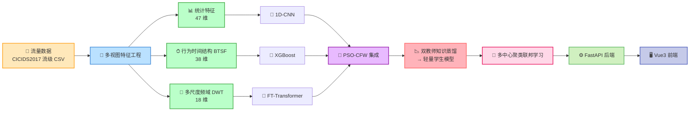

# 工业互联网智能入侵检测系统

基于**多视图特征 + 深度集成 + 双教师知识蒸馏 + 多中心聚类联邦学习**的工业互联网智能入侵检测系统（最小可演示原型）。端到端跑通「流量数据 → 多视图特征 → 教师模型集成 → 轻量学生模型 → 联邦协同 → Web 展示」全链路，全程用合成示例数据驱动，无需下载真实数据集。

## 技术架构



### 核心技术卖点（对应商业计划书）

| 卖点 | 实现 | 位置 |
| --- | --- | --- |
| **轻量化部署** | 双教师知识蒸馏，把 CNN+FT-Transformer 集成（约 4.4 万参数）压缩为 3 层小 MLP（约 0.5 万参数），可部署边缘设备 | `backend/app/core/distillation.py` |
| **高精度检测** | 三类多视图特征 + 三个分支模型 + PSO-CFW 类别级集成，测试集 F1_macro 约 0.99 | `backend/app/core/ensemble/pso_cfw.py` |
| **隐私安全可控** | 多中心聚类联邦学习，非 IID 客户端聚类后分中心 FedAvg，数据不出域 | `backend/app/core/federated.py` |
| **场景适配** | 规则引擎（签名匹配）+ 模型检测可协同，分阶段判决 | `backend/app/services/` |

## 目录结构

```
创新创业大赛项目/
├─ backend/                 # 后端（Python 3.10+ / FastAPI）
│  ├─ requirements.txt
│  ├─ app/
│  │  ├─ main.py            # FastAPI 入口
│  │  ├─ config.py          # 配置
│  │  ├─ database.py        # SQLite 建表 + 默认管理员
│  │  ├─ security.py        # 密码哈希 + token
│  │  ├─ schemas.py         # Pydantic 模型
│  │  ├─ deps.py            # 鉴权依赖
│  │  ├─ api/               # auth / data / feature / rule / detection / result / user
│  │  ├─ services/          # rule_engine / detector / scheduler
│  │  └─ core/              # 算法核心（与 Web 解耦，可独立运行）
│  │     ├─ data/           # loader（数据接入）+ synthetic（合成数据）
│  │     ├─ features/       # statistical / btsf / frequency / pipeline
│  │     ├─ models/         # cnn / xgboost / ft_transformer / student
│  │     ├─ ensemble/       # pso_cfw
│  │     ├─ distillation.py # 双教师知识蒸馏
│  │     ├─ federated.py    # 多中心聚类联邦学习
│  │     └─ detector.py     # 集成检测器（保存/加载/推理）
│  └─ scripts/
│     ├─ generate_sample_data.py
│     ├─ train.py           # 端到端训练
│     ├─ train_federated.py # 联邦学习演示
│     └─ evaluate.py
├─ frontend/                # 前端（Vue 3 + Vite + Element Plus）
│  └─ src/                  # views / layout / router / store / api / components
├─ doc/                     # 商业计划书 + 参考论文
└─ README.md
```

## 快速开始

### 环境要求

- Python 3.10+（后端）
- Node.js 18+（前端）

### 一、安装后端依赖

```bash
cd backend
pip install -r requirements.txt
```

### 二、生成示例数据 + 训练模型（可选，已提供预训练产物）

仓库已包含训练好的模型（`backend/models/`）与示例数据（`backend/data/sample_flows.csv`）。如需重新训练：

```bash
cd backend
python scripts/generate_sample_data.py   # 生成 data/sample_flows.csv
python scripts/train.py                  # 训练分支模型 + PSO-CFW + 蒸馏，输出到 models/
python scripts/train_federated.py        # 联邦学习演示（可选）
```

`train.py` 会打印三类特征维度（47 / 38 / 18）、各分支与集成/蒸馏学生模型的 Accuracy / F1，以及蒸馏前后的参数量对比。

### 三、启动后端

```bash
cd backend
uvicorn app.main:app --host 0.0.0.0 --port 8000 --reload
```

- 接口文档（Swagger）：http://localhost:8000/docs
- 健康检查：http://localhost:8000/api/health
- 默认管理员：`admin` / `admin123`

### 四、启动前端

```bash
cd frontend
npm install
npm run dev
```

浏览器访问 http://localhost:5173 （Vite 已配置 `/api` 代理到后端 8000 端口）。

## 演示流程

1. 登录系统（`admin` / `admin123`），进入**仪表盘**查看系统概览。
2. **数据管理** → 上传 `backend/data/sample_flows.csv`（或直接使用已有示例数据）。
3. **特征生成** → 选择数据集与特征类型 → 生成，查看三类视图维度（47 / 38 / 18）。
4. **规则管理** → 查看内置签名规则，可上传自定义 JSON 规则集。
5. **检测中心** → 选择数据集与模式（模型 / 规则 / 协同）→ 发起检测任务。
6. **结果分析** → 查看检测结论、攻击类别分布饼图与明细表。
7. **实时流量** → 查看模拟实时流量日志与速率曲线。
8. **用户管理**（管理员）→ 管理用户角色与启停。

## 真实数据接入

算法核心的数据接口已在 `backend/app/core/data/loader.py` 抽象好。接入 CICIDS2017 等真实数据集时：

- 下载官方 CICFlowMeter 输出的流级 CSV（字段与 `synthetic.py` 保持一致）。
- 通过 `load_cicids2017()` 读取（自动合并 Web Attack 子类、替换 inf → nan）。
- 或直接在系统「数据管理」页上传该 CSV，检测与特征生成流程无需改动。

## 依赖清单

- **后端**：`fastapi` `uvicorn[standard]` `pydantic` `numpy` `pandas` `scikit-learn` `xgboost` `torch` `PyWavelets` `python-multipart` `itsdangerous`
- **前端**：`vue` `vue-router` `pinia` `axios` `element-plus` `@element-plus/icons-vue` `echarts` `vite` `@vitejs/plugin-vue`
